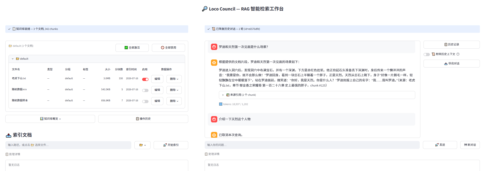

# 🏛️ Loco Council Agent

> 这是一个人类做设计，ai负责coding（占比95%），人类review（覆盖90%）兜底的项目。
>
> 面向低算力平台（比如笔记本），但是内存至少需要16G。
>
> 本意是想做成一个面向网络小说，人物传记，历史事件等长文本的小型分析工具，希望它能有一点意思，有一些意义。后来因为一个图片表格识别的任务而意外启动。
>
> 后面优先提高阅读理解方面的体验，在OCR方向的更强功能会更新较慢。

目前只支持 TXT 和 PDF 两种格式：

- **PDF**：目前写死走图片式表格数据处理逻辑，全程 OCR + 后续复杂处理（每页过 LLM 分块 + tool call），消耗一定 token。
- **TXT**：索引阶段仅在确定章节名格式时可能调 LLM 确定 regex；分块完全不依赖 LLM。

> 目前索引一个3m的txt需要1~2个小时，把embedding_batch_size调整为64可以快很多，但是16G内存的机器会有爆内存的风险。

[](https://www.python.org/)
[](https://streamlit.io/)
[](LICENSE)
[](tests/)



---

## 💡 项目简介

扫描件PDF本质是图片——没有文字层、没有结构标记、表格连边框都没有。

Loco Council Agent 专为此场景设计：**从 OCR 到回答生成的完整闭环**，核心解决三个问题：

- **无边框表格识别**：PaddleOCR + 坐标重建，把散落的文字重新拼回表格
- **语义级分块**：LLM 理解表格结构后再切块，而不是机械地按字符数截断
- **溯源准确性**：每个回答都附来源引用（文档名 + 页码 + 块编号），拒绝编造

### 总体架构

```
┌─────────────────────────────────────────────────┐
│                Streamlit 前端                      │
│         搜索问答  │  文档管理  │  会话历史           │
└─────────────────────┬───────────────────────────┘
                      │
┌─────────────────────▼───────────────────────────┐
│              Controller 调度层                     │
│   SearchController（搜索编排）                      │
│   DocController（索引编排 + 文档管理）               │
└─────────────────────┬───────────────────────────┘
                      │
┌─────────────────────▼───────────────────────────┐
│              Pipeline 业务内核                      │
│                                                    │
│  索引管线: PDF → OCR → 表格检测 → LLM分块 → 入库    │
│  检索管线: Query → 混合检索 → 重排序 → LLM打分 → 回答 │
│                                                    │
├──────────┬──────────┬──────────┬─────────────────┤
│ Indexing │Retrieval │   LLM    │    Storage      │
│  OCR+切块 │ 检索+排序 │ 通信代理  │ SQLite+LanceDB │
└──────────┴──────────┴──────────┴─────────────────┘
```

依赖方向严格单向：`UI → Controller → Pipeline → 子模块`

---

## ⚙️ 两条核心管线

### 索引管线：PDF → Chunks

```
PDF 文件
  │
  ▼
OCR 引擎 ──────── PaddleOCR + 坐标重建，逐页输出 Markdown
  │                · 3种提取策略可切换（PaddleOCR + 坐标重建 的效果可堪一用）
  │                · 图像预处理（灰度化/降噪/倾斜校正）
  │                · 无边框表格坐标重建
  ▼
表格 + 表头分析 ── 识别表格区域，提取表头语义
  │
  ▼
LLM 语义分块 ──── DeepSeek 理解表格结构后切块
  │                · 支持跨页表格（segments 数组表达）
  │                · 行覆盖校验：漏行→驳回重做→专项修补
  │                · 三层格式约束：tools → response_format → 兜底解析
  ▼
向量嵌入 ──────── BGE-M3，1024维，分批编码
  │
  ▼
双后端入库 ────── SQLite（元数据）+ LanceDB（向量 + BM25全文检索）
```

### 检索管线：Query → Answer

采用 **4 层漏斗**，逐层收窄，兼顾速度与精度：

```
用户查询
  │
  ▼
第1层 混合检索 ──── 向量 + BM25（RRF融合）→ Top 42
  │                候选为 0？→ 告知用户，可选纯LLM回答或放弃
  ▼
第2层 CrossEncoder ─ BGE-Reranker 本地模型 → 收窄到 Top 15
  │                快、免费、稳定
  ▼
第3层 LLM 分级收网 ─ DeepSeek 对每个候选打分（0-10分）
  │                ≥8过半→全取≥8 │ ≥7过半→全取≥7
  │                ≥6过半→全取≥6 │ 兜底→全取≥5
  │                全部<5？→ 低置信度提示，用户决定是否继续
  ▼
第4层 后处理 ────── 间隙填充 + 邻居扩展，补全叙事上下文
  │                受 gap_fill_token_limit 硬上限保护
  ▼
RAG 生成回答 ───── 拼接上下文 + 用户查询 → LLM 生成
                   三层容量保护：gap(20K) / context(60K) / history(5轮)
                   附来源引用（文档名 + 页码 + chunk编号 + 得分）
```

**为什么四层？** 向量+BM25负责广撒网（互补），CrossEncoder负责快速收窄（免费），LLM负责精准判断（理解复杂意图），间隙填充负责补叙事线——四层各司其职，不可合并。

---

## 🧱 分层设计

### 双后端存储

```
         DocManager（业务层唯一入口）
        ┌─────────┴─────────┐
        │                   │
  _DocMetaStore        _ChunkStore
  (SQLite)              (LanceDB)
        │                   │
  files + chunks        向量索引 + FTS
  (元数据)              (相似度 + 全文)

  HistoryStore          retriever.search()
  (会话历史)             (纯读，直调LanceDB)
```

- **SQLite** 管理元数据（文档列表、chunk归属、启用状态）
- **LanceDB** 管理向量（相似度搜索 + BM25 全文检索）
- 读写分离：DocManager 管写，retriever 管读，独立演进

### Controller 调度层

前端与后端之间引入 Controller 层，作为服务编排的唯一集成点：

```
app.py 启动层组装单例 → 依赖注入 Controller → Controller 编排 Pipeline + HistoryStore
```

Pipeline 和 HistoryStore 互不知情。Controller 是唯一知道"一次搜索需要调哪些服务"的地方。前端只负责渲染，若未来换第二个前端（CLI/API），Controller 零改动复用。

### 双引擎分块

| | FinancialTableChunker | TextChunker |
|---|---|---|
| **输入** | PDF OCR 页列表 | TXT 全文 |
| **策略** | LLM 识别表格 + tool calling | 规则先行(零token) → LLM 兜底判断章节名 |
| **LLM调用** | 每批3页一次 | 至多2次，判断章节名 |
| **降级** | 行覆盖校验→两级回退 | 段落贪心聚合（段落绝不切开） |
| **适用** | 财报/审计报告 | 小说/电子书/长文 |

---

## 📐 设计原则

1. **溯源准确性优先** — 每个回答附来源引用，检索为空时明确告知而非编造
2. **业务错误用返回值，破坏性意外用异常** — OCR失败是业务分支，网络中断是意外，处理方式不同
3. **LLM客户端只做通信代理** — 重试、分批、收发，不做业务决策
4. **规则先行，LLM兜底** — 零成本的规则匹配覆盖90%场景，LLM处理剩余10%
5. **段落绝不从中切开** — 语义完整性 > 尺寸均匀性
6. **三个硬上限保护LLM上下文** — gap(20K) / context(60K) / history(5轮)

---

## 🚀 快速开始

### 环境要求

- Python 3.10+
- Windows / Linux / macOS
- 建议 16GB+ 内存（本地模型加载 BGE-M3 ~2GB + PaddleOCR）

### 安装

```bash
# 克隆项目
git clone https://github.com/GFBinFace/loco-council-agent.git
cd loco-council-agent

# 创建虚拟环境
python -m venv .venv
source .venv/bin/activate  # Windows: .venv\Scripts\activate

# 安装依赖
pip install -r requirements.txt

# 配置环境变量
cp .env.example .env
# 编辑 .env，填入 DEEPSEEK_API_KEY
```

### 预下载模型（推荐）

首次运行前建议预下载模型（约 3.2GB，耗时取决于网络）：

```bash
python scripts/download_models.py
```

包含 BGE-M3（~2GB）、BGE-Reranker（~1GB）、PaddleOCR（~200MB）。

### 启动

```bash
streamlit run app.py
```

浏览器打开 `http://localhost:8501`，左侧上传PDF索引，右侧搜索问答。

### 常见问题

**模型下载失败（国内网络）**  
在 `.env` 中设置 `HF_ENDPOINT=https://hf-mirror.com` 使用 HuggingFace 镜像。

**启动后内存不足**  
将 `config.py` 中 `embedding_batch_size` 从 16 调小（如 8），或关闭其他应用释放内存。16GB 机器建议保持默认值。

**DeepSeek API 返回 401**  
检查 `.env` 中 `DEEPSEEK_API_KEY` 是否正确填写，确认 API 账户余额充足。

---

## 🛠️ 技术栈

| 层级 | 选型 | 说明 |
|------|------|------|
| OCR | PaddleOCR + PaddleX 3.0 | 中文识别 + 无边框表格 |
| 嵌入模型 | BAAI/bge-m3 | 1024维，8192 tokens |
| 向量数据库 | LanceDB 0.16 | 嵌入式，零运维 |
| 重排序 | BAAI/bge-reranker-base | 本地运行，免费 |
| 元数据 | SQLite | 标准库，零配置 |
| LLM | DeepSeek (OpenAI兼容协议) | `deepseek-chat` |
| 前端 | Streamlit 1.35+ | 纯Python，快速迭代 |
| 代码质量 | ruff + mypy 严格模式 | 行宽88 |

---

## 📁 项目结构

```
loco-council-agent/
  app.py              ← Streamlit 入口
  config.py           ← 全局配置（唯一配置源）
  controllers/        ← 服务调度层
  services/
    pipeline.py       ← 核心编排器
    indexing/         ← OCR + 表格检测 + 分块
    retrieval/        ← 向量化 + 混合检索 + 重排序
    storage/          ← DocManager + HistoryStore
    llm/              ← LLM客户端 + tools + prompts
  _types/             ← 数据契约
  utils/              ← 通用工具
  ui/                 ← 前端组件
  scripts/            ← CLI 脚本 + 模型下载
  tests/              ← 15个文件，178条用例
  data/               ← 运行时数据
```

---

## ✅ V0.4版开发状态

| 模块 | 状态 |
|------|------|
| OCR 引擎 + 无边框表格重建 | ✅ |
| LLM 语义分块（PDF + TXT 双引擎） | ✅ |
| 向量嵌入 + 混合检索 | ✅ |
| CrossEncoder + LLM 分级收网 | ✅ |
| RAG 生成回答 + 溯源引用 | ✅ |
| 双后端持久化 | ✅ |
| Controller 调度层 | ✅ |
| 知识库概览 + 操作历史面板 | ✅ |
| 历史会话管理 | ✅ |
| 上下文容量保护 | ✅ |
| 端到端测试 | 🔧 70% |

---

## 🗺️ 路线图

### 近期

- [ ] **补全端到端测试** — TXT 章节识别、OCR 缓存、错误边界场景（目前 70%）。
- [ ] **开机自检** — 启动时检查 SQLite、LanceDB、本地模型文件、LLM API 连通性等基础配置是否就绪，把故障定位从运行时异常提前到启动阶段。
- [ ] **批量索引** — 一次选择多个 PDF/TXT 文件执行索引（MD5 去重已就绪）。
- [ ] **突破传统 RAG 局限** — 传统 RAG 擅长细节类检索，但对综合性、全局性、概括性问题效果不佳。尝试突破这一边界，优先在小说/历史/传记类文本上探索验证，成熟后扩展至严肃数据/逻辑领域。

### 中期

- [ ] **章节地图增强** — 这是一个针对pdf的功能，当前默认关闭。已实现 rule_only 规则匹配，但尚未测试。最终目标是让 pdf 分块也像 txt 一样携带章节信息。
- [ ] **SearchResult 状态细化** — 增加 `user_abort` 等专用状态，替代当前统一使用 `success` 标记取消路径。
- [ ] **英文提示词支持** — 某些环节使用英文 prompt 配合特定模型可能获得更好效果（与 LLM 训练语料分布有关）。预留切换能力，遇具体场景再设计实现。
- [ ] **索引过期软提醒** — 在知识库概览面板标记索引天数（如"已索引 90 天"），提醒用户关注可能已过时的文档，不强制重新索引。
- [ ] **CLI / API 模式** — 利用 Controller 层的零改动复用能力，提供不依赖 Streamlit 的命令行和 HTTP API 入口。

### 远期

- [ ] **问答对管理** — 支持永久删除（落库）和临时禁用（前端内存）具体问答的功能，精细控制历史上下文组装。
- [ ] **对话历史 JSONL 迁移** — 对话历史数据从 SQLite JSON 字段迁至 `data/sessions/{id}.jsonl`（append-only 行存储），支持部分加载和并发追加。
- [ ] **体验模式（项目的 B 面）** — 当前实现的是"研究模式"：基于大块材料和多轮问答，提炼关于某个虚拟故事、历史环境或人物的核心数据，进行结构化组织和存储。计划增加"体验模式"：让用户通过对话，亲身体验身处某个历史环境中的经历，或与某个真实/虚拟人物进行交谈。核心挑战在于对象模型与多维特征列表的设计，可能需要参考社科、游戏设计等跨领域的研究成果。
- [ ] **提示词组合系统** — 参考 AutoGPT 的 pipeline + component 模式，提示词模块化、可堆叠组合，由体验模式驱动。
- [ ] **上下文管理重构** — 参考 Hermes 的上下文管理思路，但其设计偏重，计划大幅精简后定向增强。同样由体验模式的长对话场景驱动。
- [ ] **索引过期硬删除** — 在软提醒基础上，支持按策略自动标记或清理过期索引数据。
- [ ] **MinerU OCR 后端** — 可选 OCR 扩展，将 MinerU 包装为独立网络服务供主项目调用，替代 PaddleOCR 处理复杂排版场景。

---

## 📄 License

非商用自由使用，商用需授权 — 详见 [LICENSE](LICENSE)
